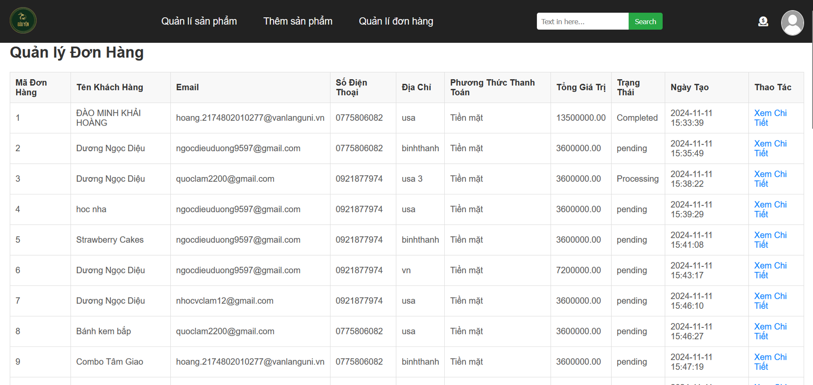

# BỬU YẾN
  _Giao diện Website_

  

  
  
  
  

  
  ___Giao diện trang chủ của website___
  

  
  
  
  
  

  
  ___Giao diện các chức năng của quản trị viên___
  

- https://www.tawk.to/
- https://dashboard.render.com/
- npm install express
